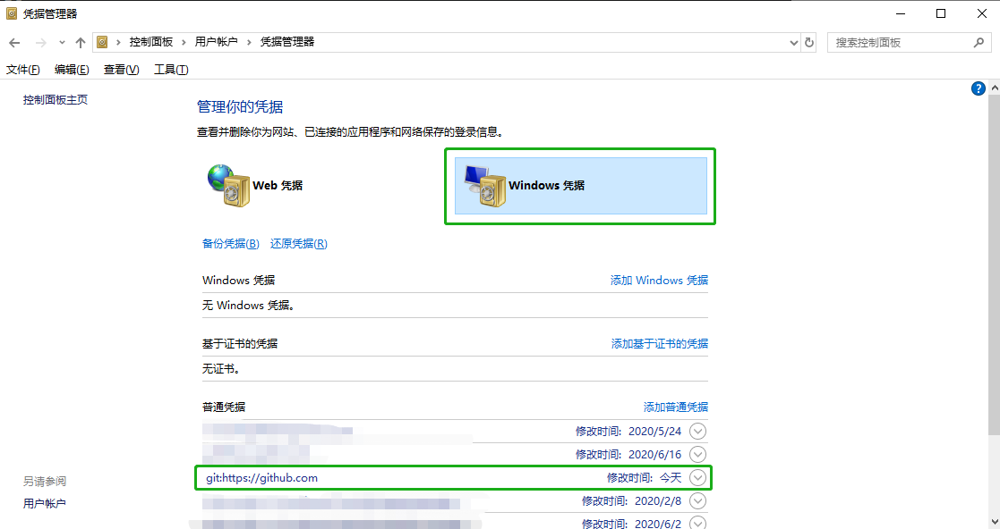

# Github Actions Error - refusing to allow an OAuth App to create or update workflow

## 解决办法

在 [`Github -> Settings -> Developer setting -> Personal access tokens`](https://github.com/settings/tokens) 中生成一个新的 token，记得把把 `workflow` 也勾上。

打开凭证管理器，把 `git:https://github.com` 的密码替换成新生成的 token。

